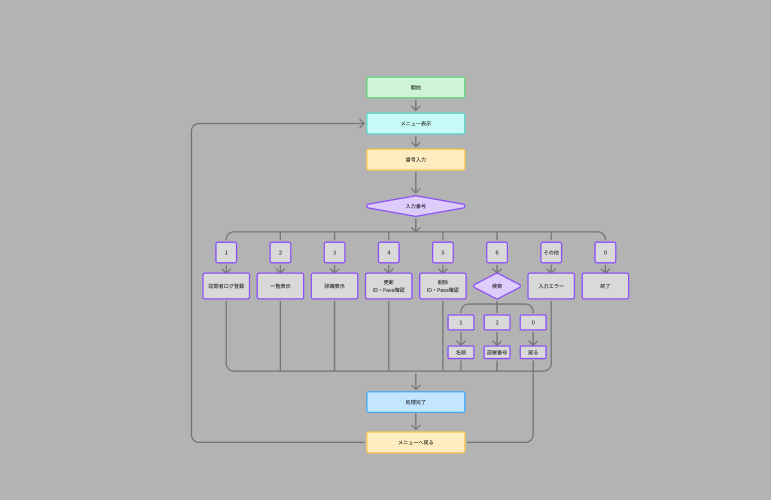

# STATUS HOUSE CLI - Visitor Log System

HTTPステータスコードをテーマにした、JavaのCLIアプリケーションです。

訪問者ログの登録・一覧表示・詳細表示・編集・削除・検索を行い、  
処理結果に応じてHTTPステータスコードを表示します。

---

## 制作目的

HTTPステータスコードを数字や名称だけで覚えるのではなく、  
CRUD操作の結果と結びつけながら理解することを目的に制作しました。

最初に基本的なCRUD機能を実装し、その後、授業で学習した

- 継承
- 抽象クラス
- インターフェース
- オーバーライド
- ポリモーフィズム
- enum

などを実際のコードに取り入れながらリファクタリングしました。

また、当初の設計から実装を進める中で機能を見直し、  
検索機能をVisitor NameとRoom Codeの2種類から選択できるように拡張しています。

---

## 主な機能

| No. | 機能 | 内容 |
| --- | --- | --- |
| 1 | Visitor Check-in | 訪問者ログを登録 |
| 2 | Visitor Log List | 登録されているログを一覧表示 |
| 3 | Visitor Log Details | IDを指定してログの詳細を表示 |
| 4 | Edit Visitor Log | IDとパスワードを使用して登録したログを編集 |
| 5 | Delete Visitor Log | IDとパスワードを使用して登録したログを削除 |
| 6 | Search Visitor Logs | Visitor NameまたはRoom Codeからログを検索 |
| 0 | Exit | アプリケーションを終了 |

---

## CRUD

| CRUD | 機能 |
| --- | --- |
| Create | Visitor Check-in |
| Read | Visitor Log List / Visitor Log Details / Search Visitor Logs |
| Update | Edit Visitor Log |
| Delete | Delete Visitor Log |

---

## 検索機能

Visitor Logは以下の2つの条件から検索できます。

- Visitor Name
- Room Code

検索メニューから検索方法を選択し、それぞれの条件に一致するVisitor Logを一覧表示します。

検索結果が存在する場合は `200 OK`、  
該当するVisitor Logが存在しない場合は `404 Not Found` を表示します。

---

## フローチャート

FigJamを使用して、アプリケーション全体の処理の流れを作成しました。



---

## HTTPステータスコード

各操作の結果に応じてHTTPステータスコードを表示します。

| Status | 使用する処理 |
| --- | --- |
| 200 OK | 一覧表示・詳細表示・検索・更新などが正常に行われた場合 |
| 201 Created | Visitor Logを登録した場合 |
| 204 No Content | Visitor Logを削除した場合 |
| 400 Bad Request | 入力値が正しくない場合 |
| 401 Unauthorized | 有効な認証情報がなく、リクエスト拒否される場合 |
| 403 Forbidden | 編集・削除時のパスワードが一致しない場合 |
| 404 Not Found | 指定した条件のVisitor Logが存在しない場合 |

HTTPステータスコードは `HttpStatus` enumを使用して管理しています。

---

## Visitor Log

1件のVisitor Logには以下のデータを保存します。

| 項目 | 型 | 内容 |
| --- | --- | --- |
| id | int | Visitor Logの管理番号 |
| visitorName | String | 訪問者名 |
| password | String | 編集・削除時の本人確認に使用する4桁のパスワード |
| roomCode | int | HTTPステータスコードを表す部屋番号 |
| message | String | 訪問者が残すメッセージ |
| visitedAt | String | 登録日時 |

パスワードはVisitor Logの一覧表示や詳細表示には表示せず、  
編集・削除時の本人確認にのみ使用します。

---

## 使用したJavaの内容

- クラス / メソッド
- コンストラクタ
- カプセル化
- 継承
- 抽象クラス
- インターフェース
- オーバーライド
- ポリモーフィズム
- enum
- final
- List / ArrayList
- if
- while
- for
- 拡張for
- try-catch
- Scanner
- パッケージ分割

---

## 設計・制作環境

| 項目 | 使用したもの |
| --- | --- |
| 開発言語 | Java |
| 開発環境 | Eclipse |
| バージョン管理 | Git / GitHub |
| 設計・フローチャート作成 | FigJam |

アプリケーションを実装する前に、機能や処理の流れを整理しました。

また、実装を進めながら設計を見直し、  
必要に応じてクラス分割や機能追加、リファクタリングを行っています。

---

## ディレクトリ構成

```text
src/
└── statushouse/
    ├── Main.java
    │
    ├── constant/
    │   └── HttpStatus.java
    │
    ├── model/
    │   └── VisitorLog.java
    │
    ├── repository/
    │   └── VisitorLogRepository.java
    │
    ├── service/
    │   ├── VisitorLogService.java
    │   ├── VisitorLogCreateService.java
    │   ├── VisitorLogReadService.java
    │   ├── VisitorLogUpdateService.java
    │   └── VisitorLogDeleteService.java
    │
    ├── ui/
    │   ├── Menu.java
    │   ├── MainMenu.java
    │   ├── CreateMenu.java
    │   ├── ListMenu.java
    │   ├── DetailMenu.java
    │   ├── UpdateMenu.java
    │   ├── DeleteMenu.java
    │   ├── VisitorLogCommonUI.java
    │   │
    │   └── search/
    │       ├── SearchMenu.java
    │       ├── SearchByVisitorNameMenu.java
    │       └── SearchByRoomCodeMenu.java
    │
    └── validation/
        └── InputValidator.java
```

---

## 各パッケージの役割

### model

Visitor Logのデータを保持します。

`VisitorLog` クラスでは、以下の情報を管理しています。

- ID
- Visitor Name
- Password
- Room Code
- Message
- Visited At

---

### repository

`ArrayList<VisitorLog>` を使用してVisitor Logをメモリ上に保管します。

主に以下の処理を担当します。

- Visitor Logの保存
- 一覧取得
- ID検索
- Visitor Name検索
- Room Code検索
- 削除

---

### service

Visitor Logに対する処理を担当します。

処理内容ごとにServiceクラスを分割しています。

- `VisitorLogCreateService`
- `VisitorLogReadService`
- `VisitorLogUpdateService`
- `VisitorLogDeleteService`

各Serviceで共通して使用する `VisitorLogRepository` は、  
抽象クラス `VisitorLogService` にまとめています。

各Serviceが `VisitorLogService` を継承することで、  
同じRepositoryを共通して利用できる構成にしています。

---

### ui

ユーザーからの入力受付と、コンソールへの表示を担当します。

各Menuクラスは `Menu` インターフェースを実装し、  
共通して `show()` メソッドを持つようにしています。

主なMenuクラスは以下です。

- `CreateMenu`
- `ListMenu`
- `DetailMenu`
- `UpdateMenu`
- `DeleteMenu`
- `SearchMenu`

---

### ui/search

検索処理に関するUIをまとめています。

検索方法によって処理を分割しています。

- `SearchMenu`
- `SearchByVisitorNameMenu`
- `SearchByRoomCodeMenu`

`SearchMenu` で検索方法を選択し、  
それぞれの検索Menuへ処理を移します。

---

### validation

ユーザーから入力された値をチェックします。

主に以下の入力チェックを行います。

- 空文字ではないか
- 数値として使用できるか
- メニュー番号として正しいか

---

### constant

HTTPステータスコードとメッセージを `HttpStatus` enumで管理します。

各Menuクラスにステータスコードを直接記述するのではなく、  
共通のenumから取得することで管理しやすくしています。

---

## リファクタリング

最初はCRUD機能を正常に動作させることを優先して実装しました。

その後、重複している処理や共通する役割を見直し、  
授業で学習したオブジェクト指向の内容を取り入れながらリファクタリングしました。

---

### Serviceの継承

Create / Read / Update / Delete の各Serviceでは、  
共通して `VisitorLogRepository` を使用しています。

そこで `VisitorLogService` という抽象クラスを作成し、  
Repositoryを親クラスで管理するように変更しました。

各Serviceは `VisitorLogService` を継承しています。

```java
public abstract class VisitorLogService {

    protected final VisitorLogRepository repository;

    protected VisitorLogService(VisitorLogRepository repository) {
        this.repository = repository;
    }
}
```

---

### Menuインターフェース

各Menuクラスが共通して `show()` メソッドを持っていたため、  
`Menu` インターフェースを作成しました。

```java
public interface Menu {
    void show();
}
```

各Menuクラスで `Menu` を実装し、  
`show()` メソッドをオーバーライドしています。

Mainクラスでは各Menuを `Menu` 型として配列にまとめています。

```java
Menu[] menus = {
    null,
    createMenu,
    listMenu,
    detailMenu,
    updateMenu,
    deleteMenu,
    searchMenu
};
```

選択されたメニュー番号を使用して、  
共通の `show()` メソッドを呼び出します。

```java
menus[menuNumber].show();
```

これにより、Mainクラスで各Menuごとに個別の処理を書く必要を減らしました。

---

### 共通表示処理

Visitor Logを表示する処理が複数のMenuクラスで重複していたため、  
`VisitorLogCommonUI` に共通処理としてまとめました。

```java
public void visitorLogCommonShow(VisitorLog log) {
    System.out.println("ID: " + log.getId());
    System.out.println("Visitor Name: " + log.getVisitorName());
    System.out.println("Room Code: " + log.getRoomCode());
    System.out.println("Message: " + log.getMessage());
    System.out.println("Visited At: " + log.getVisitedAt());
}
```

一覧・詳細・検索などから同じ表示処理を呼び出せるようにしています。

---

### 検索機能の分割

検索処理は `SearchMenu` にすべて記述するのではなく、  
検索方法ごとにクラスを分割しました。

```text
SearchMenu
├── SearchByVisitorNameMenu
└── SearchByRoomCodeMenu
```

`SearchMenu` は検索方法を選択する役割を担当し、  
実際の検索処理は各Menuクラスが担当します。

---

### HTTPステータスコードのenum化

当初は各画面でHTTPステータスコードを直接扱っていましたが、  
`HttpStatus` enumにまとめて管理するようにしました。

これにより、ステータスコードとメッセージを1か所で管理できます。

---

## 工夫したポイント

### 1. HTTPステータスコードとCRUD操作を関連付けた

HTTPステータスコードを単純に表示するだけではなく、  
Visitor Logに対する操作結果と関連付けています。

例えば、

- 登録成功 → `201 Created`
- 取得成功 → `200 OK`
- 削除成功 → `204 No Content`
- 入力エラー → `400 Bad Request`
- パスワード不一致 → `403 Forbidden`
- データが存在しない → `404 Not Found`

のように、操作結果とHTTPステータスコードを結び付けました。

---

### 2. 当初設計から検索機能を発展させた

当初はIDを使用した検索機能を想定していました。

しかし、IDによる検索はVisitor Log Detailsでも行っているため、  
実装を進める中で検索機能の役割を見直しました。

最終的には、より複数のVisitor Logを探しやすくするため、

- Visitor Name検索
- Room Code検索

の2種類から検索できる仕様へ変更しました。

また、検索機能が増えたことで1つのクラスに処理をまとめるのではなく、

- `SearchMenu`
- `SearchByVisitorNameMenu`
- `SearchByRoomCodeMenu`

に分割し、それぞれの役割を明確にしました。

---

### 3. 編集・削除時にパスワード確認を追加した

Visitor Logを誰でも編集・削除できる仕様ではなく、  
登録時に4桁のパスワードを設定するようにしました。

編集・削除時にはパスワードを入力し、  
登録されているパスワードと一致した場合のみ操作を続行できます。

パスワードが一致しない場合は `403 Forbidden` を表示します。

---

### 4. UIの共通処理をまとめた

一覧表示・詳細表示・検索結果などでは、  
Visitor Logを同じ形式で表示します。

同じコードを各Menuクラスに繰り返し記述するのではなく、  
`VisitorLogCommonUI` にまとめることで重複を減らしました。

---

### 5. Menuをインターフェースで統一した

各Menuが `show()` を持つという共通点に着目し、  
`Menu` インターフェースを作成しました。

Mainクラスでは各Menuを `Menu` 型として扱うことで、  
同じ方法で各画面を呼び出せるようにしています。

---

## 実行例

アプリケーションを起動すると、以下のメニューが表示されます。

```text
===== STATUS HOUSE =====
1. Visitor Check-in
2. Visitor Log List
3. Visitor Log Details
4. Edit Visitor Log
5. Delete Visitor Log
6. Search Visitor Logs
0. Exit
========================
```

---

### Visitor Log登録

Visitor Check-inでは、以下の情報を入力します。

```text
Visitor Name: Hashio
Password: ****
Room Code: 404
Message: Not Found Room
```

登録に成功すると `201 Created` が表示されます。

```text
----- HTTP Status Code -----
201 Created
----------------------------

ID: 1
Visitor Name: Hashio
Room Code: 404
Message: Not Found Room
Visited At: 2026-09-25T...
```

---

### 検索

Search Visitor Logsを選択すると、  
検索方法を選択できます。

```text
===== Search =====
1. Search by Visitor Name
2. Search by Room Code
0. Back
==================
```

Visitor NameまたはRoom Codeを入力すると、  
条件に一致するVisitor Logを表示します。

---

### 編集・削除

編集・削除時にはVisitor LogのIDを指定し、  
登録時に設定した4桁のパスワードを入力します。

パスワードが一致した場合のみ処理を続行します。

一致しない場合は以下を表示します。

```text
----- HTTP Status Code -----
403 Forbidden
----------------------------
```

---

## データの保存について

Visitor Logは `ArrayList` を使用してメモリ上に保存しています。

そのため、現在はアプリケーションを終了すると  
登録したVisitor Logは削除されます。

---

## 今後の改善点

- Room Codeとして入力可能なHTTPステータスコードを制限する
- HTTPステータスコードごとの意味や説明など各項目ごとの表示をできるようにする
- ファイルやデータベースを使用してデータを永続化する
- 同一訪問者による同じRoom Codeの重複登録を制御する
- パスワードの管理方法を改善する
- 検索条件をさらに追加する
