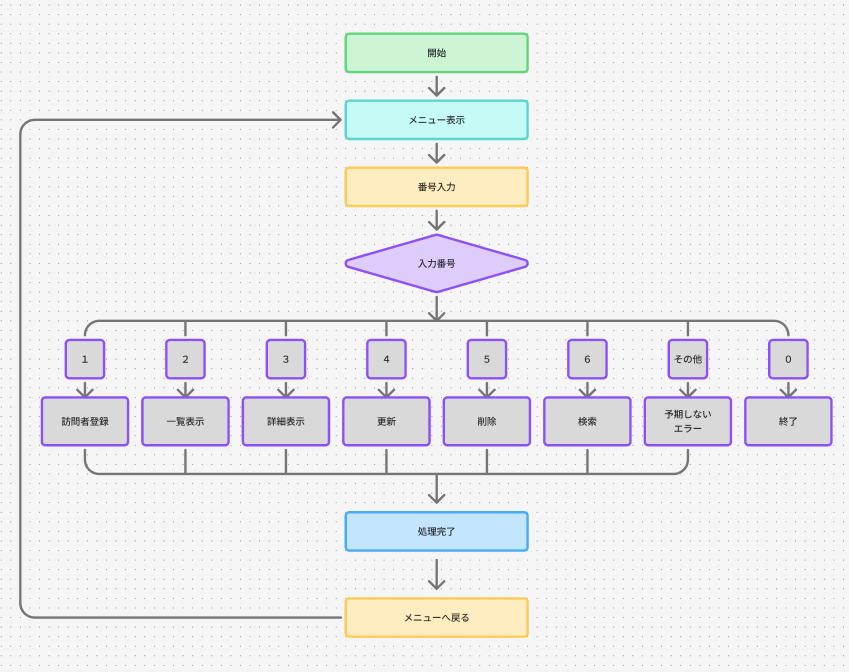

# STATUS HOUSE CLI - Visitor Log System

HTTPステータスコードをテーマにした、JavaのCLIアプリケーションです。

訪問者ログの登録・一覧表示・詳細表示・編集・削除・ID検索を行い、処理結果に応じてHTTPステータスコードを表示します。

---

## 制作目的

HTTPステータスコードを数字や名称だけで覚えるのではなく、CRUD操作の結果と結びつけながら理解することを目的に制作しました。

最初に基本的なCRUD機能を実装し、その後、授業で学習した継承・インターフェース・ポリモーフィズムなどを実際のコードに取り入れながらリファクタリングしました。

---

## 主な機能

| No. | 機能 | 内容 |
| --- | --- | --- |
| 1 | Visitor Check-in | 訪問者ログを登録 |
| 2 | Visitor Log List | 登録されているログを一覧表示 |
| 3 | Visitor Log Details | IDを指定してログの詳細を表示 |
| 4 | Edit Visitor Log | 登録したログを編集 |
| 5 | Delete Visitor Log | 登録したログを削除 |
| 6 | Search by ID | IDからログを検索 |
| 0 | Exit | アプリケーションを終了 |

---

## CRUD

| CRUD | 機能 |
| --- | --- |
| Create | Visitor Check-in |
| Read | Visitor Log List / Visitor Log Details / Search by ID |
| Update | Edit Visitor Log |
| Delete | Delete Visitor Log |

---

## フローチャート

FigJamを使用して、アプリケーション全体の処理の流れを作成しました。



---

## HTTPステータスコード

処理結果に応じてHTTPステータスコードを表示します。

| Status | 使用する処理 |
| --- | --- |
| 200 OK | 一覧表示・詳細表示・検索・更新 |
| 201 Created | Visitor Logの登録 |
| 204 No Content | Visitor Logの削除 |
| 404 Not Found | 指定したIDのログが存在しない場合 |

HTTPステータスコードは `HttpStatus` enumを使用して管理しています。

---

## Visitor Log

1件のVisitor Logには以下のデータを保存します。

| 項目 | 型 | 内容 |
| --- | --- | --- |
| id | int | Visitor Logの管理番号 |
| visitorName | String | 訪問者名 |
| roomCode | int | HTTPステータスコードを表す部屋番号 |
| message | String | 訪問者が残すメッセージ |
| visitedAt | String | 登録日時 |

---

## 使用したJavaの内容

- クラス / メソッド
- コンストラクタ
- カプセル化
- 継承
- 抽象クラス
- インターフェース
- オーバーライド
- ポリモーフィズム
- enum
- final
- List / ArrayList
- if
- while
- for
- 拡張for
- try-catch
- Scanner
- パッケージ分割

---

## 設計・制作環境

| 項目 | 使用したもの |
| --- | --- |
| 開発言語 | Java |
| 開発環境 | Eclipse |
| バージョン管理 | Git / GitHub |
| 設計・フローチャート作成 | FigJam |

アプリケーションを実装する前に機能や処理の流れを整理し、フローチャートはFigJamを使用して作成しました。

---

## ディレクトリ構成

```text
src/
└── statushouse/
    ├── Main.java
    │
    ├── constant/
    │   └── HttpStatus.java
    │
    ├── model/
    │   └── VisitorLog.java
    │
    ├── repository/
    │   └── VisitorLogRepository.java
    │
    ├── service/
    │   ├── VisitorLogService.java
    │   ├── VisitorLogCreateService.java
    │   ├── VisitorLogReadService.java
    │   ├── VisitorLogUpdateService.java
    │   └── VisitorLogDeleteService.java
    │
    ├── ui/
    │   ├── Menu.java
    │   ├── MainMenu.java
    │   ├── CreateMenu.java
    │   ├── ListMenu.java
    │   ├── DetailMenu.java
    │   ├── UpdateMenu.java
    │   ├── DeleteMenu.java
    │   ├── SearchMenu.java
    │   └── VisitorLogCommonUI.java
    │
    └── validation/
        └── InputValidator.java
```

---

## 各パッケージの役割

### model

Visitor Logのデータを保持します。

### repository

`ArrayList<VisitorLog>` を使用してVisitor Logを保管し、保存・一覧取得・ID検索・削除を行います。

### service

Visitor Logの登録・取得・更新・削除の処理を担当します。

各Serviceで共通して使用するRepositoryは、`VisitorLogService` にまとめて継承しています。

### ui

ユーザーからの入力受付とコンソールへの表示を担当します。

各Menuクラスは `Menu` インターフェースを実装し、`show()` メソッドをオーバーライドしています。

### validation

入力された値が空文字ではないか、数値として使用できるか、メニュー番号として正しいかなどを確認します。

### constant

HTTPステータスコードとメッセージを `HttpStatus` enumで管理します。

---

## リファクタリング

最初はCRUD機能を動作させることを優先して実装しました。

その後、重複している処理や共通する役割を見直し、授業で学習した内容を取り入れながらリファクタリングしました。

### Serviceの継承

Create / Read / Update / Delete の各Serviceで使用していた `VisitorLogRepository` は新たに `VisitorLogService` という親クラスを作成することで、まとめました。

### Menuインターフェース

各Menuが共通して `show()` を持っているため、`Menu` インターフェースを作成しました。

インターフェースの実装に合わせ、Mainクラスにて、各Menuを `Menu` 型としてまとめています。

```java
Menu[] menus = {
    null,
    createMenu,
    listMenu,
    detailMenu,
    updateMenu,
    deleteMenu,
    searchMenu
};
```

選択されたメニュー番号を使用して、共通の `show()` メソッドを呼び出します。

```java
menus[menuNumber].show();
```

### 共通表示

Visitor Logの表示処理が複数のMenuで重複していたため、`VisitorLogCommonUI` にまとめました。

### HTTPステータスコード

各画面に直接記述していたHTTPステータスコードを `HttpStatus` enumでまとめて管理しています。

---

## 実行例

アプリを起動すると以下のメニューが表示されます。

```text
===== STATUS HOUSE =====
1. Visitor Check-in
2. Visitor Log List
3. Visitor Log Details
4. Edit Visitor Log
5. Delete Visitor Log
6. Search by ID
0. Exit
========================
```

Visitor Logを登録すると、以下のように表示されます。

```text
201 Created

ID: 1
Visitor Name: Hashio
Room Code: 404
Message: Not Found Room
Visited At: 2026-09-25T...
```

---

## データの保存について

Visitor Logは `ArrayList` を使用してメモリ上に保存しています。

そのため、現在はアプリケーションを終了すると登録したデータは削除されます。

---

## 今後の改善点

- Room Codeとして入力できるHTTPステータスコードの制限（SVG形式にまとめ、存在しないものは弾くなど）
- HTTPステータスコードごとの説明表示を必須にする（現在のメッセージ項目を詳細に設定できる仕様へ）
- ファイルやデータベースへの保存
- 訪問者１人につき、重複したステータスコードの作成はできないよう制御する
